# Alternative Approaches to VAC Bypass

Other ways to bypass or evade VAC from user-mode, whether encrypted comms can be intercepted, and threats VAC cannot address (DMA, network, kernel). Based on Daniel Krupinski's reverse engineering and bypass.

> **Disclaimer:** Educational only.

---

## Table of Contents

- [What Daniel Got Right](#what-daniel-got-right)
- [Alternative User-Mode Bypass Approaches](#alternative-user-mode-bypass-approaches)
  - [A. Syscall-Level Data Poisoning](#a-syscall-level-data-poisoning)
  - [B. File Mapping Manipulation](#b-file-mapping-manipulation)
  - [C. Module Delivery Interception](#c-module-delivery-interception)
  - [D. Report Layer Poisoning](#d-report-layer-poisoning)
  - [E. Thread Suspension Timing Attack](#e-thread-suspension-timing-attack)
  - [F. Full Data Fabrication](#f-full-data-fabrication)
- [Intercepting VAC's Encrypted Communications](#intercepting-vacs-encrypted-communications)
- [Beyond User-Mode: Threats VAC Cannot Address](#beyond-user-mode-threats-vac-cannot-address)
  - [DMA Cheats](#dma-cheats)
  - [Network-Level Cheats](#network-level-cheats)
  - [Kernel Cheats via Custom Driver](#kernel-cheats-via-custom-driver)
  - [BYOVD - Bring Your Own Vulnerable Driver](#byovd----bring-your-own-vulnerable-driver)
- [The Fundamental Insight](#the-fundamental-insight)
- [Credits](#credits)

---

## What Daniel Got Right

VAC has five modules, 172 API pointers, multiple `NtQuerySystemInformation` classes, handle enumeration, VMT validation, and more. Daniel avoided fighting any of it. He targeted the one gate everything passes through: `Utils_getSystemInformation` checks `dwPageSize == 4096` before any scan. Hook `GetSystemInfo`, return 1337, and the scan bails. Valve gets nothing.

Small surface area (8 hooks, 1 patched byte), early exit so no module runs, and failsafes that kill Steam on fallback so no report is sent. VAC's dynamic API resolution means every lookup goes through `GetProcAddress`; hook that and you control what VAC gets. ~200 lines of C.

Other user-mode strategies exist, each with different trade-offs. Most are fragile or noisier. A few are worth noting.

---

## Alternative User-Mode Bypass Approaches

### A. Syscall-Level Data Poisoning

Daniel's approach kills the scan before it starts. But what if you let it run and just fed it garbage?

VAC calls `NtQuerySystemInformation` with 7 different information classes. None are hooked by Daniel's bypass. Instead of preventing the scan, we could hook the `ntdll.dll` syscall stub for `NtQuerySystemInformation` and filter the results in real time.

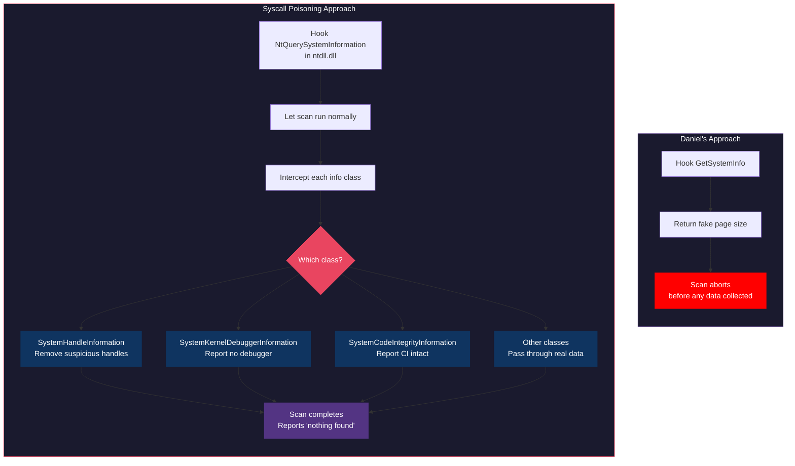

**What you could do with this:**
- Strip your cheat's handles out of the `SystemHandleInformation` results so ProcessHandleList never sees them
- Remove cheat drivers from `EnumServicesStatusW` output
- Tell VAC there's no kernel debugger even when you're actively debugging
- Report code integrity as clean even with DSE bypassed

From a telemetry perspective this is cleaner: no report at all can be a signal; a full scan that sends "nothing found" looks like a clean host. In practice you must know every `NtQuerySystemInformation` output layout and edit buffers without corrupting them; `SystemHandleInformation` is variable-length with huge entry counts. The `ntdll` syscall stub format also varies across Windows builds, and some setups use direct `syscall`; the approach tends to break across versions.

---

### B. File Mapping Manipulation

VAC's ProcessMonitor module communicates with `steamservice.dll` through a Windows file mapping with a predictable name:

```
Steam_{E9FD3C51-9B58-4DA0-962C-734882B19273}_Pid:%08X
```

This mapping contains a magic value (`0x30004`) and a pointer to a `VacProcessMonitor` object (292 bytes) with a virtual method table (6 methods, 24 bytes). ProcessMonitor validates that each VMT pointer falls within `steamservice.dll`'s address range.

The name is deterministic. Any process that knows the game's PID can open this mapping.

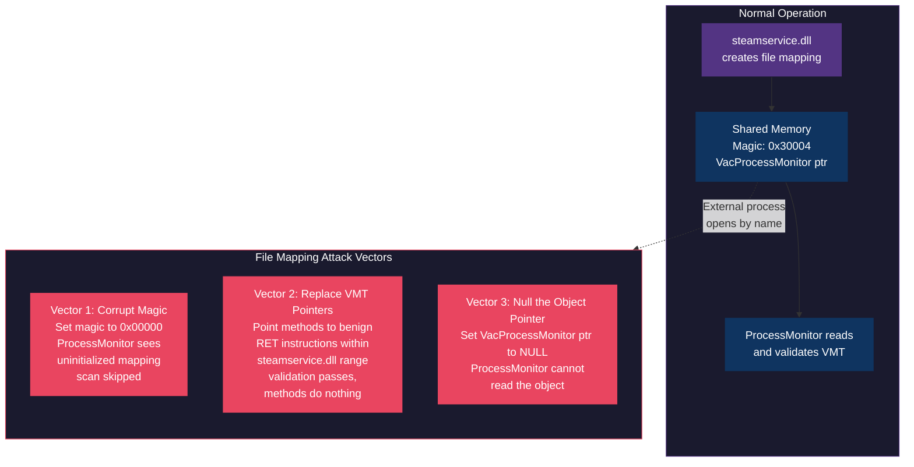

Vector 2 is the one that matters: validation only checks `(method_ptr & 0xFFFF0000) == steamservice_base`, so any address in `steamservice.dll` passes. Point VMT entries at `RET` gadgets inside that range and the check passes while the methods do nothing. Daniel's bypass stops the scan before ProcessMonitor runs, so this only matters if scan order changed. Forensically clean (no patches, no hooks, no injection; just tweak shared memory and exit). Only affects ProcessMonitor; the other modules don't use this mapping.

---

### C. Module Delivery Interception

VAC modules are DLLs streamed from Valve's servers to the client. `steamservice.dll` receives them over the network, decrypts them, and loads them into the game process. What if they never arrive?

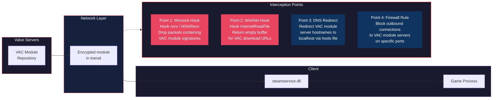

**Point 1 (Winsock Hook)** is the most practical user-mode approach. By hooking `recv` or `WSARecv` in `steamservice.dll`, incoming data can be inspected for VAC module signatures. If a packet looks like a module download, return 0 bytes or an error code. `steamservice.dll` sees a network failure and the module never loads.

**Point 3 (DNS Redirect)** is the simplest but most detectable. Editing the `hosts` file to redirect VAC server hostnames to `127.0.0.1` prevents module downloads without any code injection. However, Valve could detect the hosts file modification, and Steam may validate DNS responses.

**Point 4 (Firewall Rule)** operates outside the process entirely. A Windows Firewall rule blocking outbound connections to VAC module server IPs would prevent downloads. This requires knowing the server IPs, which could change, but operates at the OS level with no code injection.

Same issue as Daniel's: no module load means no report. A network failure is more plausible than an odd page size, but missing reports can still be flagged.

---

### D. Report Layer Poisoning

Let VAC run to completion, then rewrite the report before it leaves the machine.

VAC encrypts scan results through two layers:
1. **XOR encryption** - DWORD-by-DWORD with a server-provided key (e.g., `0x1D4855D3`)
2. **ICE cipher** - 16-round Feistel network, 8-byte blocks, 4 S-boxes with 1024 entries each

The encrypted report is then transmitted back to Valve.

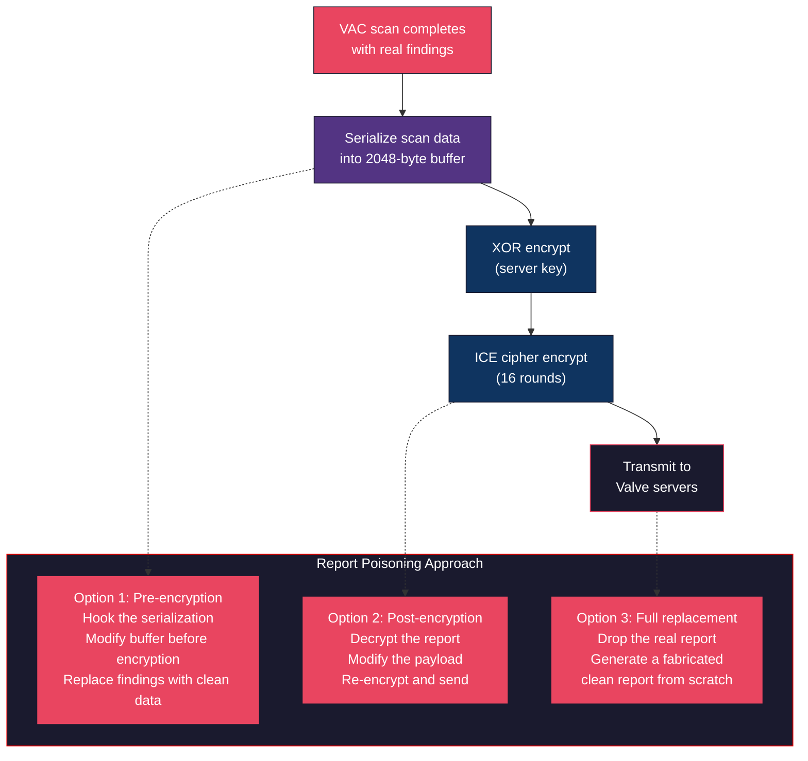

Option 1 (pre-encryption) is the practical path: hook the code that fills the 2048-byte buffer, zero or replace findings, then let encryption run. Valve gets a valid encrypted report that decrypts to "nothing found." Option 2 (post-encryption) needs the XOR key (capturable from the session) and the ICE key (e.g. from `Ice_set()`); then decrypt, modify, re-encrypt.

From a telemetry perspective this produces the fewest obvious anomalies, assuming the report format has not drifted and no extra server-side checks fire. The cost is high: exact report layout, byte-to-finding mapping, and any server-side integrity (checksums, HMACs, nonces) must be understood and preserved.

---

### E. Thread Suspension Timing Attack

VAC modules are loaded via `LoadLibraryExW`, which creates a new module in the process. Between the moment the module is loaded and the moment its scan thread begins execution, there is a timing window.

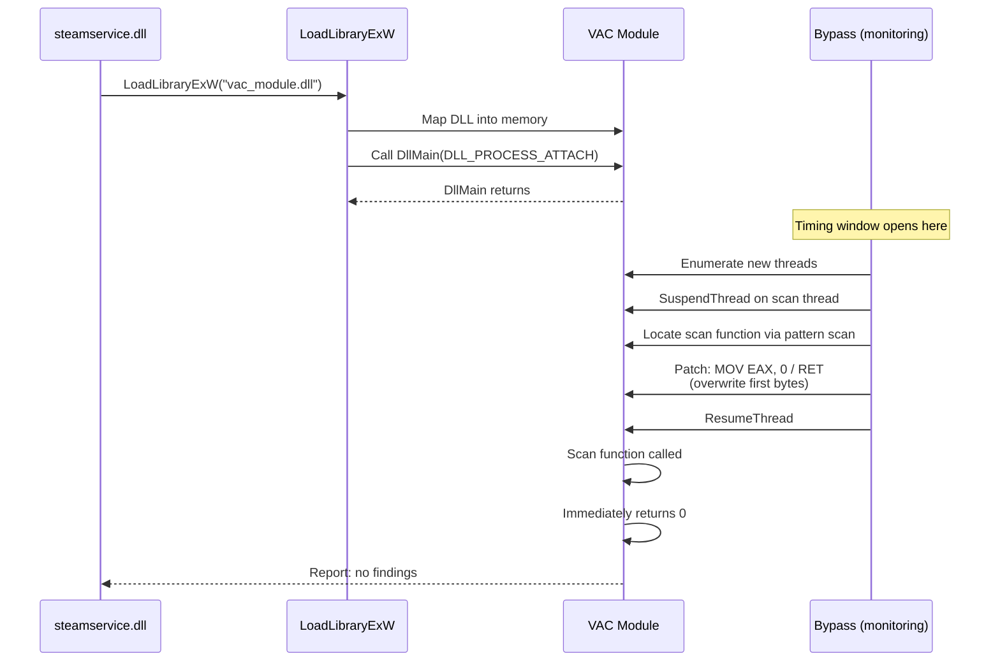

**How it works:**
1. Hook `LoadLibraryExW` (same as Daniel's approach) to detect when a VAC module loads
2. After the module is mapped, enumerate newly created threads via `CreateToolhelp32Snapshot(TH32CS_SNAPTHREAD)`
3. Suspend the scan thread with `SuspendThread`
4. Pattern scan the module's `.text` section for the scan initialization function
5. Overwrite the first bytes with `XOR EAX, EAX / RET` (return 0)
6. Resume the thread

**Advantage over Daniel's approach:** No persistent API hooks. The hooks are only needed briefly during module load. After patching, the hooks can be removed entirely, leaving no hookable trace for later integrity checks.

**Risk:** The timing window between module load and thread execution is narrow. If the scan thread starts before suspension, the patch arrives too late. This can be mitigated by hooking `CreateThread` to catch the scan thread at creation time and suspend it before it runs.

---

### F. Full Data Fabrication

The inverse of Daniel's approach. Instead of preventing the scan, **complete it successfully with entirely fabricated data**.

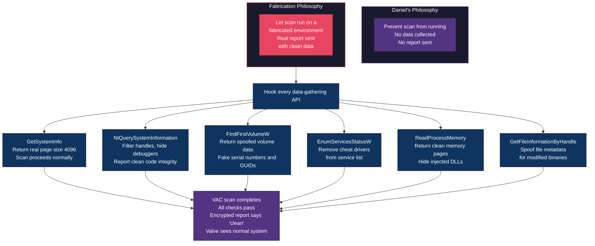

Return the real page size (4096) so the scan proceeds, and hook every data-gathering API to present a clean system:

| API | Fabricated Response |
|-----|-------------------|
| `GetSystemInfo` | Real data (page size 4096, real CPU info) |
| `NtQuerySystemInformation(SystemHandleInformation)` | Real handles minus any with suspicious access rights to the game |
| `NtQuerySystemInformation(SystemKernelDebuggerInformation)` | No debugger attached |
| `NtQuerySystemInformation(SystemCodeIntegrityInformation)` | Code integrity intact |
| `EnumServicesStatusW` | Real services minus cheat drivers |
| `FindFirstVolumeW` / `FindNextVolumeW` | Spoofed serial numbers if evading hardware ban |
| `ReadProcessMemory` | Clean memory pages at checked offsets |
| `GetFileInformationByHandle` | Original file indices for modified binaries |

Assuming consistency across all spoofed data (e.g. fake volume serials match everywhere they're queried), the result looks like a clean host. The cost is hooking 20+ APIs and knowing each return format; one inconsistency can be detected server-side. Daniel's 8-hook approach achieves the same practical outcome with far less work and maintenance.

---

## Intercepting VAC's Encrypted Communications

An entirely different attack surface: the data flowing between VAC's servers and the client. VAC modules are delivered encrypted, and scan reports are transmitted encrypted. Could this channel be inspected, decrypted, or manipulated?

### The Encryption Stack

VAC uses a layered encryption approach for both module delivery and scan reporting:

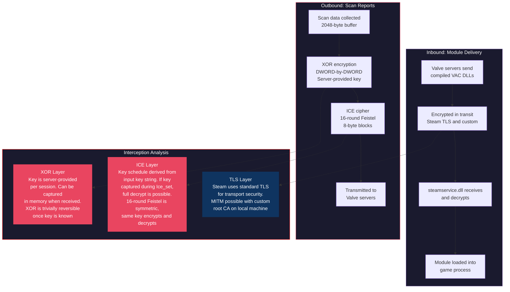

### Can the XOR Layer Be Broken?

Yes, trivially. The XOR key is provided by the server at the start of each session. It arrives in plaintext (within the TLS stream) and is stored in memory. Two approaches:

1. **Memory capture:** Hook the function that receives the XOR key from the server, or scan memory for the key after it arrives. XOR keys like `0x1D4855D3` are 4 bytes and used for the entire 2048-byte buffer. Once known, the XOR layer can be applied or removed at will.

2. **Known-plaintext attack:** If any portion of the scan report is predictable (e.g., fixed header bytes, known structure offsets), XORing the known plaintext against the ciphertext reveals the key directly.

### Can the ICE Cipher Be Broken?

Not through cryptanalysis - the ICE cipher is a 16-round Feistel network and is cryptographically sound for its intended purpose. However, it doesn't need to be broken:

- **Key capture:** The ICE key is set via `Ice_set()`, which takes a key string and builds the key schedule. Hooking this function captures the key at initialization. Since ICE is symmetric, the same key decrypts.
- **Pre-encryption interception:** Hook the buffer before it enters encryption. The plaintext scan data is available in memory as a 2048-byte buffer before `Ice_encrypt()` is called.
- **S-box reconstruction:** The 4 S-boxes (1024 entries each) are initialized at runtime via `Ice_InitSboxes()`. Capturing them after initialization allows offline decryption of any report encrypted with the same configuration.

### Can Module Delivery Be Decrypted?

Module delivery uses Steam's own transport encryption (TLS). On the local machine, this can be intercepted by:

1. **Installing a custom root CA** and performing a local MITM on Steam's TLS connections
2. **Hooking the decryption output** in `steamservice.dll` - capturing the module bytes after decryption but before loading
3. **Dumping from memory** after the module is loaded into the game process, since the decrypted DLL exists as a mapped image

Daniel's VAC repository itself is proof that module delivery can be decrypted and analyzed - his entire reverse engineering project is based on disassembling the decrypted module binaries.

### Practical Implications

The encryption stack protects against **passive network observers** (ISPs, public Wi-Fi sniffers) but provides no protection against **the machine owner**. Since the encryption keys exist in memory on the client and the decrypted data is processed in user-mode, anyone with admin access to the machine can inspect everything.

You cannot protect secrets from the owner of the machine. Encryption helps against passive observers; keys and plaintext exist on the client, so the primary threat (the user) is not mitigated.

---

## Beyond User-Mode: Threats VAC Cannot Address

Daniel's work operates entirely within Ring 3 (user-mode). But the most impactful cheat architectures for CS:GO operated at layers VAC could never reach. These are not bypass techniques - they are architectures that make VAC irrelevant regardless of how it is implemented.

### DMA Cheats

Direct Memory Access cheats use a hardware device (typically a PCIe card, commonly referred to as a "DMA card") to read game memory through the PCIe bus without involving the CPU at all.

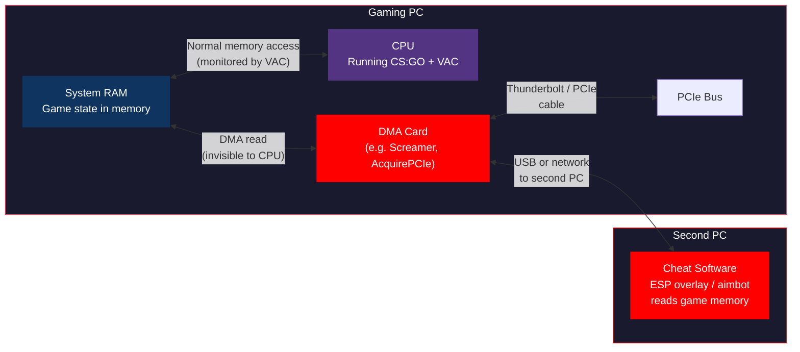

**Why VAC is completely blind to this:**

- The DMA card reads physical memory addresses directly via the PCIe bus. This does not trigger any software interrupt, syscall, or API call. The CPU is not involved.
- No process is created on the gaming PC. `NtQuerySystemInformation(SystemHandleInformation)` sees nothing.
- No driver is loaded on the gaming PC. `EnumServicesStatusW` sees nothing.
- No handle is opened to the game process. Handle enumeration finds nothing.
- The cheat software runs on a completely separate machine. Even a kernel-mode anti-cheat on the gaming PC cannot detect software running on a different computer.

**The DMA card itself** is typically a modified FPGA device that presents itself as a legitimate PCIe peripheral (e.g., a network card). The gaming PC's OS sees a normal device in Device Manager.

**What can DMA cheats do?**
- Read all player positions, health, weapon data from game memory
- Feed this to a second monitor showing a radar or ESP overlay
- With write access (bidirectional DMA), modify game memory to implement aimbot, speed hacks, or teleportation - though writing is riskier as it can cause game crashes if the wrong addresses are modified

**What could theoretically detect this:**
- IOMMU (Input/Output Memory Management Unit) configuration that restricts which physical memory regions DMA devices can access. However, most gaming PCs have IOMMU disabled for performance, and cheat DMA firmware can often work around basic IOMMU configurations.
- Kernel-mode anti-cheat that monitors PCIe device enumeration (e.g., checking for FPGA-based devices), but this is a cat-and-mouse game as DMA firmware evolves to impersonate legitimate devices.

---

### Network-Level Cheats

Rather than reading memory locally, network cheats intercept game packets in transit and extract game state from the network data itself.

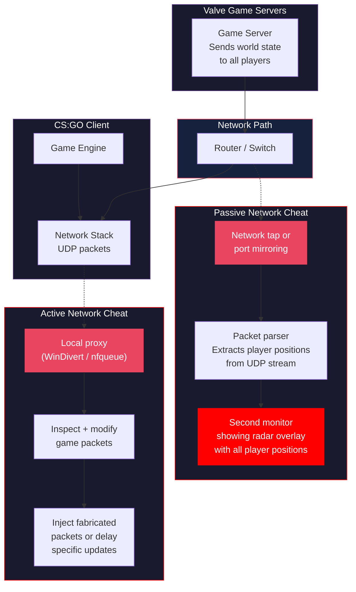

**Passive network cheats** tap the network without modifying anything:

- **Packet sniffing:** Use a network tap, port mirroring on a managed switch, or a promiscuous-mode capture on the local NIC. Extract UDP game packets and parse them for player position data.
- **Radar overlay:** Send parsed positions to a second PC or second monitor displaying a real-time radar showing all player locations. No software runs on the gaming PC beyond the normal game client.
- **Why VAC can't detect this:** The sniffing happens at the network layer, outside the game process, outside the OS, often on separate hardware entirely. There is no process, no handle, no driver, no file to detect.

**Active network cheats** use a local packet filter to modify game traffic:

- **WinDivert / Npcap:** Kernel-mode packet filter drivers that can intercept, inspect, and modify network packets before they reach the game client or after they leave it.
- **Selective packet delay:** Delay position update packets for specific players to gain a reaction-time advantage.
- **Packet injection:** Fabricate packets that the game client interprets as legitimate server updates.

**CS:GO's specific vulnerability:** Source Engine games historically sent more world-state data to clients than strictly necessary. While Valve implemented "trusted mode" and server-side visibility checks to limit what data clients receive, earlier versions sent enough information for a network parser to reconstruct a full radar of all player positions - even players behind walls.

**The encryption challenge:** Modern game protocols use encryption on the UDP stream, making passive sniffing harder. However, since the game client must decrypt the packets to process them, the decryption keys exist in memory on the gaming PC. A DMA card or local memory read can extract the session keys, enabling real-time decryption of the network stream on a second machine.

---

### Kernel Cheats via Custom Driver

A cheat running as a signed kernel driver has complete control over the system and is invisible to any user-mode anti-cheat.

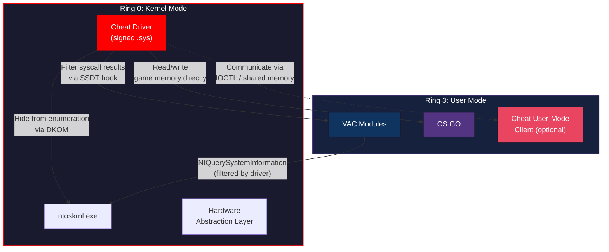

**Getting a driver signed** is the primary barrier. Windows requires kernel drivers to be signed with an Extended Validation (EV) code signing certificate. There are two paths:

**Path 1: Legitimate EV certificate**
- Purchase an EV code signing certificate from a Certificate Authority (~$300-500/year)
- Requires a registered business entity with verification
- Sign the driver through Microsoft's Hardware Developer Center (attestation signing for Windows 10+)
- The driver loads normally via `sc create` + `sc start`
- **Detection risk:** Valve can report the driver's certificate thumbprint. Once identified, the certificate can be revoked by the CA and the driver signature blacklisted by Microsoft. This is a one-time-use approach unless multiple certificates are rotated.

**Path 2: Self-signed with test signing enabled**
- Generate a self-signed certificate and sign the driver locally
- Enable test signing mode: `bcdedit /set testsigning on`
- The driver loads, but Windows displays a "Test Mode" watermark on the desktop
- **Detection risk:** VAC queries `SystemCodeIntegrityInformation` which reveals test signing is enabled. Trivially detectable.

**What a kernel driver can do that VAC cannot see:**
- **DKOM (Direct Kernel Object Manipulation):** Unlink the cheat's `EPROCESS` entry from the kernel's process list. The process continues running but is invisible to `NtQuerySystemInformation`, Task Manager, and every user-mode enumeration API.
- **SSDT hooking:** Modify the System Service Descriptor Table to intercept any syscall. When VAC calls `NtQuerySystemInformation`, the hooked syscall handler filters the results before they reach user-mode.
- **Page table manipulation:** Map game memory into the driver's address space without opening a handle. No handle means handle enumeration sees nothing.
- **Physical memory read/write:** Access physical RAM addresses directly, bypassing all access checks.

---

### BYOVD - Bring Your Own Vulnerable Driver

Rather than obtaining a signing certificate, exploit a vulnerability in a **legitimately signed driver** to gain kernel code execution.

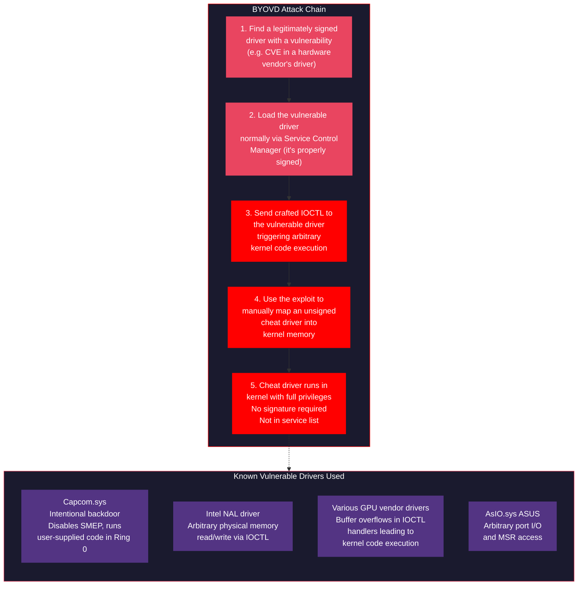

The vulnerable driver is legitimately signed and loads normally. VAC might see it in the service list but it's a real vendor driver; flagging it would false-positive on many machines. The exploit gives kernel execution via the driver's IOCTL; the cheat driver is then manually mapped (e.g. `ExAllocatePool`, copy, call entry point) and never appears in the loaded module list or service enumeration.

**The cat-and-mouse game:** Microsoft maintains a vulnerable driver blocklist (`Microsoft Vulnerable Driver Blocklist`) that prevents known-exploitable drivers from loading. However, new vulnerabilities are discovered faster than the blocklist is updated, and legacy systems may not have the latest blocklist.

**Even kernel-mode anti-cheat struggles here.** EAC, BattlEye, and Vanguard all attempt to detect BYOVD by:
- Maintaining their own driver blocklists
- Monitoring for suspicious IOCTL patterns
- Checking for manually mapped kernel memory regions (pool allocations with executable permissions)
- Scanning for known exploit signatures

But this is fundamentally a reactive defense. Each new vulnerable driver requires a new blocklist entry. The attacker only needs one driver that hasn't been blocklisted yet.

---

## Conclusion

At the same privilege level, the scanner never gets the last word. That is the limitation Daniel's work exposes: ~200 lines of C turn off VAC because it runs in the same process with the same rights. User-mode cannot verify that kernel responses are honest; kernel cannot verify the hypervisor; software cannot see DMA. The industry moved to kernel-level anti-cheat (EAC, BattlEye, Vanguard) to get a privilege advantage; the arms race then moved to hypervisors and hardware. Operating above the adversary's layer is what actually changes the game.

---

## Credits

[Daniel Krupinski](https://github.com/danielkrupinski): [VAC](https://github.com/danielkrupinski/VAC), [VAC-Bypass](https://github.com/danielkrupinski/VAC-Bypass). License: MIT.
