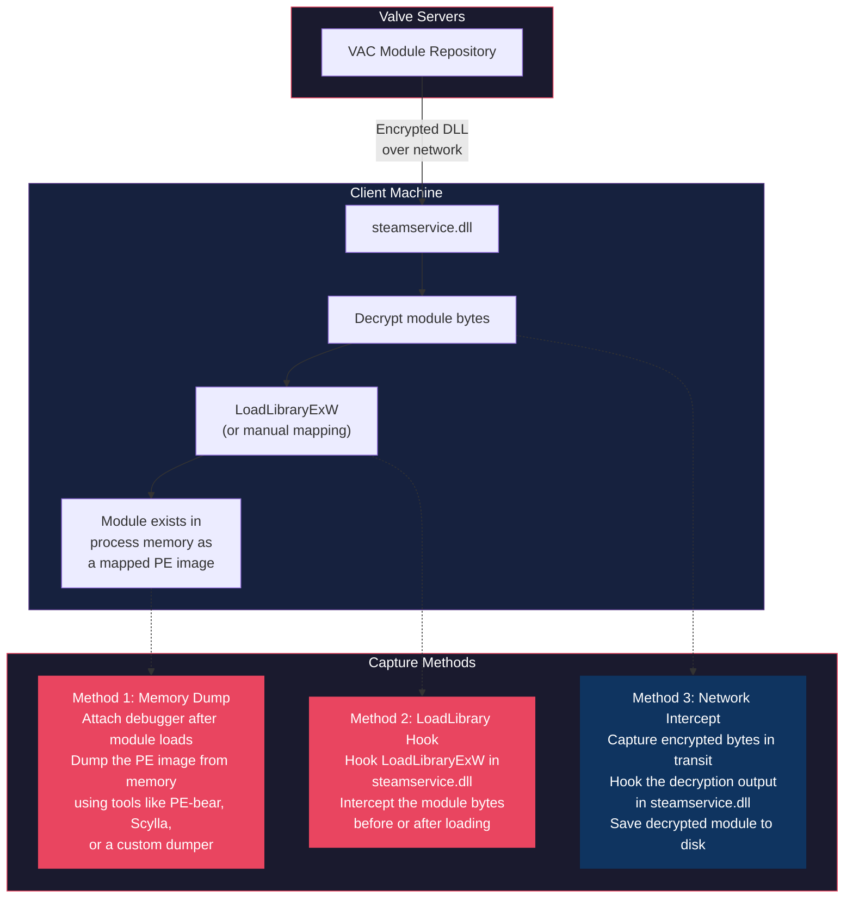
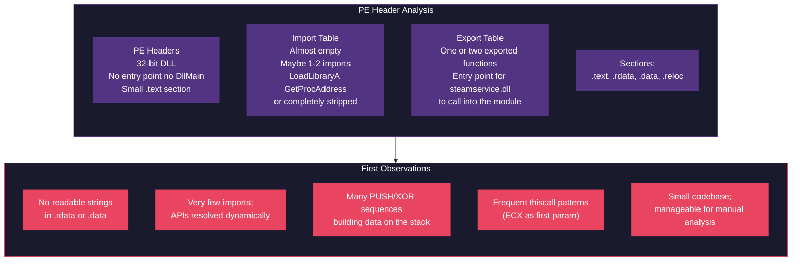
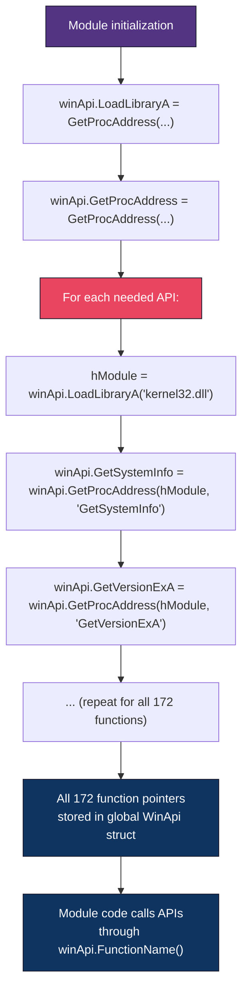
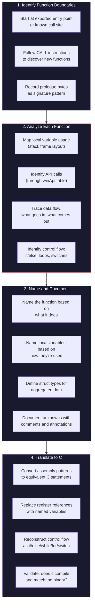
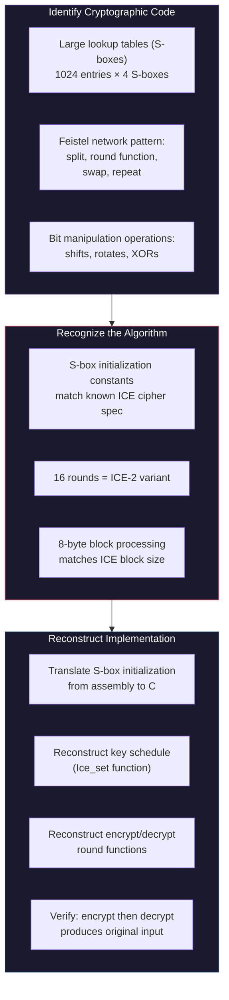
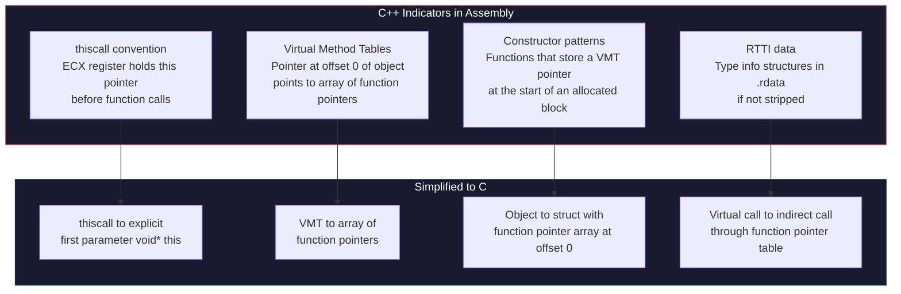
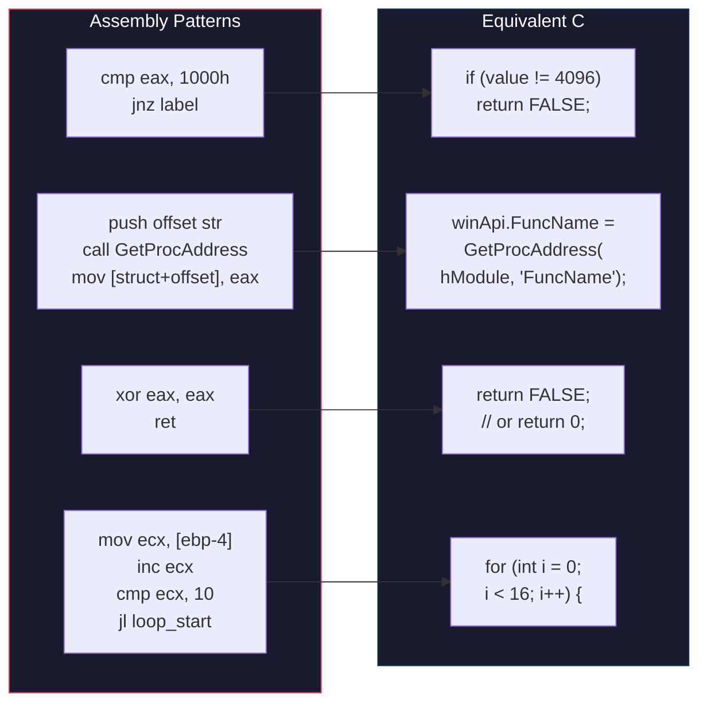
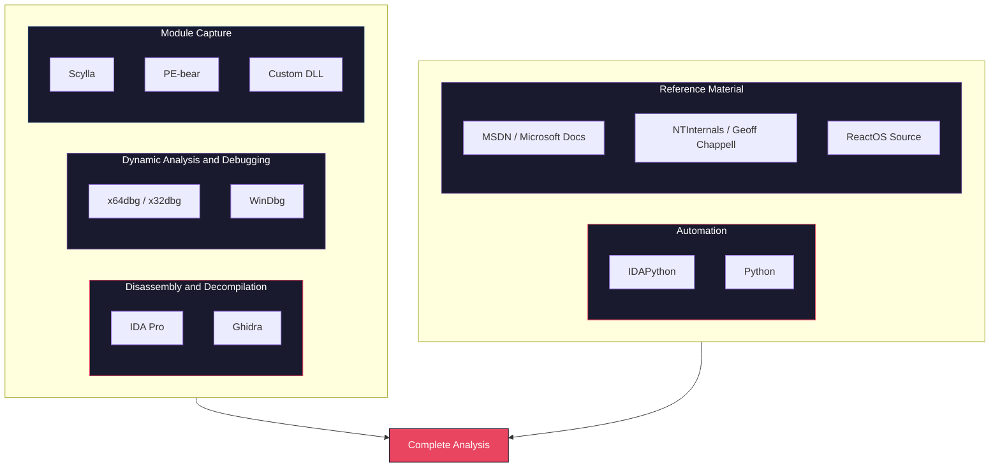

# How VAC Was Reverse Engineered

How the [reconstructed VAC source](https://github.com/danielkrupinski/VAC) was likely produced from compiled 32-bit DLLs. The methodology is inferred from evidence in the code: byte-pattern signatures, preserved XOR literals, buffer offset maps, and comments where analysis stopped.

> **Disclaimer:** Educational only.

---

## Table of Contents

- [Overview](#overview)
- [Phase 1: Obtaining the VAC Modules](#phase-1-obtaining-the-vac-modules)
- [Phase 2: Static Analysis, First Pass](#phase-2-static-analysis-first-pass)
- [Phase 3: Defeating String Obfuscation](#phase-3-defeating-string-obfuscation)
- [Phase 4: Reconstructing the API Resolution Layer](#phase-4-reconstructing-the-api-resolution-layer)
- [Phase 5: Function-by-Function Disassembly](#phase-5-function-by-function-disassembly)
- [Phase 6: Reverse Engineering the Encryption Layer](#phase-6-reverse-engineering-the-encryption-layer)
- [Phase 7: Mapping the Data Structures](#phase-7-mapping-the-data-structures)
- [Phase 8: Understanding the Object-Oriented Patterns](#phase-8-understanding-the-object-oriented-patterns)
- [Phase 9: Translating to Compilable C Source](#phase-9-translating-to-compilable-c-source)
- [Evidence in the Code](#evidence-in-the-code)
- [Tools Likely Used](#tools-likely-used)
- [What Made VAC Feasible to Reverse Engineer](#what-made-vac-feasible-to-reverse-engineer)
- [Credits](#credits)

---

## Overview

The repo holds C source reconstructed from compiled 32-bit VAC modules. Those modules were never shipped as source; they were streamed as encrypted binaries from Valve, decrypted by `steamservice.dll`, and loaded into the game process. What appears in the repo is a decompilation: machine code translated back to readable C, not the original (likely C++ with `thiscall`), but functionally equivalent.

---

## Phase 1: Obtaining the VAC Modules

The binaries are not on disk; they are ephemeral DLLs streamed from Valve and loaded into memory.

### How the Modules Were Likely Captured



**Method 1 (Memory Dump)** is the most straightforward. Once a VAC module is loaded into the game process, it exists as a standard PE image in memory. A debugger or memory dumping tool can extract it:

1. Launch a VAC-secured game (CS:GO)
2. Wait for VAC modules to be streamed and loaded
3. Attach a debugger or use a process memory dumper
4. Enumerate loaded modules to find the VAC DLLs (they would appear as unnamed or suspiciously-loaded modules)
5. Dump the PE image from memory to disk

Since the modules are 32-bit DLLs with known `.text` section sizes (0x5C00, 0x4A00, 0x6600), they can be identified by their characteristics even without knowing their names.

Method 2 (LoadLibrary hook) is what Daniel's [VAC-Bypass](https://github.com/danielkrupinski/VAC-Bypass) does: hook `LoadLibraryExW` in `steamservice.dll` to intercept loads. The same hook can save module bytes. Method 3 would capture at the decryption boundary in `steamservice.dll`, which requires reversing that DLL first. In practice, a combination of 1 and 2 is likely: hook load, then dump the PE from memory for a clean binary.

### Repeated Capture

Three modules over 217 commits suggests an iterative process; modules were probably captured repeatedly as Valve updated them. The `.text` sizes in the README act as version fingerprints.

---

## Phase 2: Static Analysis, First Pass

With the raw DLL binaries on disk, the first step is loading them into a disassembler. The goal of the first pass is to understand the high-level structure before diving into individual functions.

### What the Disassembler Reveals Immediately



No readable strings in `.rdata`; instead, byte sequences on the stack and XOR loops. Almost no imports despite 172 API calls, so resolution is dynamic. The largest module (SystemInfo) is ~0x5C00 bytes of .text (~23 KB), which is small enough to analyze in a reasonable time once obfuscation is cracked.

---

## Phase 3: Defeating String Obfuscation

The first real analytical work is cracking the string encoding. Without readable strings, the disassembly is a maze of unnamed function calls and unexplained constants. With them, the code becomes self-documenting.

### How XOR String Encoding Works in VAC

In the reconstructed source, strings appear like this:

```c
CHAR ntDll[] = "\x68\x52\x62\x4A\x4A\x8\x42\x4A\x4A";
// ...
PCHAR curr = ntDll;
while (*curr) {
    *curr ^= '&';
    ++curr;
}
// ntDll now contains "NtDll.dll"
```

In the compiled binary, this looks like:

```
; Push encoded bytes onto the stack
mov byte ptr [ebp-10h], 68h  ; 'N' ^ '&' = 0x68
mov byte ptr [ebp-0Fh], 52h  ; 't' ^ '&' = 0x52
mov byte ptr [ebp-0Eh], 62h  ; 'D' ^ '&' = 0x62
mov byte ptr [ebp-0Dh], 4Ah  ; 'l' ^ '&' = 0x4A
mov byte ptr [ebp-0Ch], 4Ah  ; 'l' ^ '&' = 0x4A
mov byte ptr [ebp-0Bh], 08h  ; '.' ^ '&' = 0x08
mov byte ptr [ebp-0Ah], 42h  ; 'd' ^ '&' = 0x42
mov byte ptr [ebp-09h], 4Ah  ; 'l' ^ '&' = 0x4A
mov byte ptr [ebp-08h], 4Ah  ; 'l' ^ '&' = 0x4A
mov byte ptr [ebp-07h], 00h  ; null terminator

; XOR decode loop
.loop:
    xor byte ptr [eax], 26h   ; XOR with '&'
    inc eax
    cmp byte ptr [eax], 0
    jnz .loop
```

This is likely one of the first things Daniel automated. Once you identify the XOR key for a module (VAC uses `^`, `>`, and `&`), a simple IDA Python or Ghidra script can:

1. Scan the binary for the characteristic XOR decode loop pattern
2. Walk backwards to find the encoded byte sequence on the stack
3. Apply the XOR key to decode the string
4. Add a comment or rename the local variable in the disassembly

After this step, every `GetProcAddress` call becomes annotated with the function name it resolves. The entire control flow of the module becomes legible.

### What the Decoded Strings Reveal

From the SystemInfo module alone, the decoded strings expose:

| Encoded Bytes | XOR Key | Decoded String | Reveals |
|---|---|---|---|
| `\x68\x52\x62\x4A\x4A\x08\x42\x4A\x4A` | `&` | `NtDll.dll` | Which system DLL is loaded |
| `\x6D\x43\x54\x48\x43\x4A\x15\x14\x08\x42\x4A\x4A` | `&` | `Kernel32.dll` | Which system DLL is loaded |
| `\x68\x52\x77\x53\x43\x54\x5F\x75\x5F...` | `&` | `NtQuerySystemInformation` | Which API is called |
| `\x61\x43\x52\x70\x43\x54\x55\x4F\x49\x48` | `&` | `GetVersion` | Which API is called |
| `\x61\x43\x52\x68\x47\x52\x4F\x50\x43...` | `&` | `GetNativeSystemInfo` | Which API is called |

With these decoded, the purpose of every code block becomes obvious.

---

## Phase 4: Reconstructing the API Resolution Layer

With the strings decoded, the next step is understanding how VAC resolves its API functions. This is critical because the entire module's functionality depends on it.

### The WinApi Function Table

From the disassembly, Daniel identified a global structure (reconstructed as `WinApi winApi`) that holds pointers to every Windows API function the module needs. The module populates this table early in its initialization:



In the disassembly, this looks like repeated patterns of:
1. Push an encoded string onto the stack
2. Decode it with XOR
3. Call `GetProcAddress` with the decoded name
4. Store the result at a fixed offset in a global data structure

By analyzing every such sequence, Daniel could reconstruct the full `WinApi` struct with named fields. The reconstructed code shows this as:

```c
WinApi winApi;
// winApi.GetCurrentProcessId, winApi.GetCurrentThreadId,
// winApi.GetSystemInfo, winApi.GetVersionExA, etc.
```

The 172 function pointers and 12–16 module handles come from counting resolution sequences and measuring the struct in `.data`.

---

## Phase 5: Function-by-Function Disassembly

With strings decoded and the API table mapped, the actual reverse engineering of each function begins. The reconstructed code preserves byte-pattern signatures above every function.

### The Byte Pattern Signatures

Every function in the reconstructed code has a comment like:

```c
// 83 C8 FF 83 E9 00
INT Utils_getProtect(BYTE a)

// E8 ? ? ? ? 89 7E 04 (relative jump)
LPVOID Utils_heapAlloc(SIZE_T size)

// 51 A1 ? ? ? ?
BOOLEAN Utils_getSystemInformation(VOID)

// 55 8B EC B8
INT SystemInfo_collectData(...)
```

They are the first bytes of each function in the compiled binary. Two roles:

They identify each function in the binary so anyone with the DLL can find it; `?` covers bytes that vary (e.g. addresses in relative jumps). Signatures with "(relative jump)" mean the function was found via a `CALL` to it, not by its prologue.

### The Analysis Workflow



### Example: Tracing `Utils_getSystemInformation`

The function with signature `// 51 A1 ? ? ? ?` was identified as the system information gathering function. Here's how the analysis likely proceeded:

**Step 1: Identify the function's role.**
The function calls the usual system-info APIs (all in the already-mapped table), so its role is clear.

**Step 2: Map the control flow.**
The disassembly shows a sequence of conditional checks:
- If `GetCurrentProcessId()` returns 0, return FALSE
- If `GetCurrentThreadId()` returns 0, return FALSE
- If `systemInfo.dwPageSize != 4096`, return FALSE
- If `GetVersionExA()` fails, return FALSE
- If `GetSystemDirectoryW()` fails, return FALSE
- If `GetWindowsDirectoryW()` fails, return FALSE
- Otherwise, return TRUE

**Step 3: Notice the page size check.**
This is where Daniel found the vulnerability that his bypass exploits. In the assembly, it looks like:

```
call    [winApi.GetSystemInfo]
cmp     dword ptr [ebp+systemInfo.dwPageSize], 1000h  ; 4096
jnz     return_false
```

This single comparison became the target of the entire bypass.

**Step 4: Identify the bug.**
Daniel even found a bug in Valve's code and annotated it:

```c
// VALVE PLS FIX - BUFFER SIZE SHOULD BE MAX_PATH
winApi.GetWindowsDirectoryW(data.windowsDirectory, sizeof(data.windowsDirectory))
```

This kind of comment only comes from someone who has carefully compared the API call against its documentation and noticed that `sizeof()` returns the buffer size in bytes rather than the character count expected by `GetWindowsDirectoryW`.

---

## Phase 6: Reverse Engineering the Encryption Layer

VAC uses the ICE cipher and XOR encryption for its communications. The reconstructed `Ice.c` file represents a particularly impressive feat of reverse engineering: recreating a complete cryptographic implementation from compiled code.

### How the ICE Cipher Was Reconstructed



ICE is a published algorithm (Matthew Kwan, 1997). Once S-box constants and Feistel structure were recognized, the rest was identification and parameter confirmation against the spec, not full cryptanalysis. XOR is trivial: DWORD-by-DWORD with a server key (e.g. `0x1D4855D3`) over a 2048-byte buffer.

The `Utils_iceEncrypt` function processes exactly 512 iterations of 8-byte blocks (512 × 8 = 4096 bytes), and `Utils_iceDecrypt` processes `size / 8` blocks. These parameters were determined directly from the loop counters in the disassembly.

---

## Phase 7: Mapping the Data Structures

Data structures are labor-intensive: no types, no field names, only offsets from base pointers.

### How Buffer Layouts Were Reconstructed

In `SystemInfo_collectData`, the scan results are written to a `DWORD data[2048]` array (a 2048-element DWORD array = 8192 bytes, though the final encrypted output is described as 2048 bytes). Each element at a specific index holds specific data:

```c
data[4]  = 0xA93E4B10;              // Magic / module identifier
data[6]  = ntQuerySystemInformation(SystemTimeOfDayInformation, ...);
data[14] = sti.CurrentTime.LowPart;
data[15] = sti.CurrentTime.HighPart;
data[16] = sti.BootTime.LowPart;
data[17] = sti.BootTime.HighPart;
data[18] = getVersion();
data[19] = sci.CodeIntegrityOptions;
data[20] = si.wProcessorArchitecture;
data[21] = si.dwProcessorType;
// ... continues through data[447]
```

Every `MOV [base+offset], value` in the disassembly maps to one `data[index] = value` in the reconstruction (e.g. offset 0x18/4 = data[6], 0x50/4 = data[20]). By tracing where each value comes from (which API call, which struct field), Daniel built the complete map of what information occupies each slot in the output buffer.

### Reconstructing Custom Structs

VAC uses several undocumented Windows structures and custom types. For example:

```c
typedef struct _SYSTEM_TIMEOFDAY_INFORMATION_ {
    LARGE_INTEGER BootTime;
    LARGE_INTEGER CurrentTime;
    LARGE_INTEGER TimeZoneBias;
    ULONG TimeZoneId;
    ULONG Reserved;
    ULONGLONG BootTimeBias;
    ULONGLONG SleepTimeBias;
} SYSTEM_TIMEOFDAY_INFORMATION_;
```

This struct is undocumented by Microsoft. Its layout was determined by:

1. Observing the buffer size passed to `NtQuerySystemInformation` (the second parameter tells you the struct size)
2. Watching which offsets within the returned buffer are accessed after the call
3. Cross-referencing with community documentation (e.g., Geoff Chappell's Windows internals research, ReactOS source code, or NTInternals.net)

The `VolumeData` struct was similarly reconstructed by observing which fields are filled for each volume during the `FindFirstVolumeW`/`FindNextVolumeW` enumeration loop:

```c
struct VolumeData {
    UINT volumeGuidHash;
    DWORD getVolumeInformationError;
    DWORD fileSystemFlags;
    DWORD volumeSerialNumber;
    UINT volumeNameHash;
    UINT fileSystemNameHash;
    WORD driveType;
    WORD volumePathNameLength;
    DWORD volumePathNameHash;
}; // sizeof(VolumeData) == 32
```

The 32-byte size comes from the stride between volume entries in the output buffer.

---

## Phase 8: Understanding the Object-Oriented Patterns

The VAC README notes: *"Client VAC infrastructure is built using C++ (indicated by many thiscall convention functions present in disassembly)."* The ProcessMonitor module in particular uses virtual method tables (VMTs), which are a C++ compiler artifact.

### Identifying C++ in Assembly



The ProcessMonitor module reads a `VacProcessMonitor` object (292 bytes) from shared memory, including its VMT (6 methods, 24 bytes). In the disassembly, this appears as:

```
; Read object at pointer from file mapping
mov     eax, [mapped+4]          ; VacProcessMonitor pointer
; Read VMT (first DWORD of object is VMT pointer)  
mov     ecx, [eax]               ; VMT pointer
; Read individual method pointers
mov     edx, [ecx]               ; Method 0
mov     edx, [ecx+4]             ; Method 1
; ... through Method 5
```

The reconstruction uses plain C structs instead of C++ classes; behavior is preserved, readability improved.

---

## Phase 9: Translating to Compilable C Source

The final phase is producing readable, compilable C code from the annotated disassembly. This is where artistry meets engineering.

### Translation Principles



### What Gets Lost in Translation

The reconstructed C is not a perfect mirror of what the original developer wrote. Compiler optimizations destroy information:

| Lost Information | Example |
|---|---|
| **Original variable names** | `data[34]` could have been `scanResult.processId` in the original source |
| **Comments and documentation** | All internal documentation is gone |
| **Code organization** | The original might have used different file/folder structure |
| **Class hierarchy** | C++ classes are flattened to C structs |
| **Inline functions** | The compiler may have inlined small functions, making them appear as part of the caller |
| **Optimization artifacts** | Some C constructs look odd because they mirror how the compiler chose to optimize |
| Original data types | `DWORD` vs `unsigned int` vs `UINT32`; the binary doesn't distinguish |

### What's Preserved

| Preserved Information | How |
|---|---|
| **Logic and control flow** | Conditional branches, loops, and function calls are all recoverable |
| **API usage** | Every Windows API called and its parameters |
| **Data layout** | Exact byte offsets of every field in every structure |
| **Constants** | Magic numbers, XOR keys, buffer sizes |
| **Algorithmic behavior** | The exact sequence of operations performed |

---

## Evidence in the Code

The reconstructed source contains several artifacts that reveal the reverse engineering process:

### 1. Byte Pattern Signatures

Every function is annotated with its binary signature:

```c
// 83 C8 FF 83 E9 00
INT Utils_getProtect(BYTE a)

// E8 ? ? ? ? 89 7E 04 (relative jump)
LPVOID Utils_heapAlloc(SIZE_T size)
```

These serve as cross-references back to the original binary. Anyone with the DLL can search for these byte patterns to find the corresponding function.

### 2. Preserved XOR-Encoded String Literals

The string obfuscation is preserved verbatim rather than replaced with decoded strings:

```c
CHAR ntDll[] = "\x68\x52\x62\x4A\x4A\x8\x42\x4A\x4A";
```

This shows the analyst wanted to document exactly how the binary stores and decodes its strings, not just what the strings say.

### 3. Uncertainty Comments

Where analysis was incomplete, it's noted honestly:

```c
if (ntdllHandle != INVALID_HANDLE_VALUE) {
    // read ntdll.dll file and do some processing
} else {
    data[46] = ntdllOpenErr;
}
```

Incremental analysis: some paths were left for later or were too complex to finish.

### 4. Bug Annotations

```c
// VALVE PLS FIX - BUFFER SIZE SHOULD BE MAX_PATH
// https://docs.microsoft.com/en-us/windows/win32/api/sysinfoapi/nf-sysinfoapi-getwindowsdirectoryw
```

Finding bugs in the target code is a strong indicator of deep understanding. The analyst compared every API call against its documentation and noticed this one passes `sizeof()` (byte count) where the API expects a character count.

### 5. Magic Number Documentation

```c
data[4] = 0xA93E4B10;  // Module identifier
// ...
if (mapped[0] == 0x30004)  // magic number set by steamservice.dll
```

Constants were identified by usage: static values at fixed offsets used as validation tokens.

### 6. The 217 Commit History

The repository has 217 commits, indicating this was a long-running iterative process. New functions were analyzed and committed incrementally, uncertain sections were revisited and improved, and new module versions were captured and re-analyzed as Valve updated VAC.

---

## Tools Likely Used

Based on the artifacts in the code, the nature of the analysis, and standard practice in the Windows reverse engineering community, the following tools were most likely used:



---

## What Made VAC Feasible to Reverse Engineer

Not all software is equally amenable to reverse engineering. Several properties of VAC made it a viable target:

### 1. Small Codebase

The modules are tiny. The largest is ~23 KB of code. Compare this to a game engine (millions of lines) or an operating system kernel. A single determined analyst can fully reverse 23 KB of x86 in a reasonable timeframe.

### 2. Heavy Use of Known APIs

VAC calls 172 Windows API functions. Every one of these is documented by Microsoft with precise parameter and return value specifications. Once you know a function calls `NtQuerySystemInformation(SystemKernelDebuggerInformation, ...)`, you know exactly what data it's requesting and what the response structure looks like. The APIs are self-documenting landmarks.

### 3. Simple Obfuscation

String encoding is single-byte XOR. No control-flow flattening, no VM obfuscation, no anti-disassembly. Once the key is known, strings decode trivially.

### 4. No Anti-Debugging

The modules don't check for debuggers attached to themselves (they check for debuggers on the *game* process, which is different). This means an analyst can freely set breakpoints, single-step, and inspect memory while the module runs.

### 5. No Anti-Tamper

The modules don't validate their own integrity after loading. They don't checksum their own code sections, don't detect memory breakpoints, and don't verify that their import tables haven't been modified. This allows an analyst to patch the module in memory during debugging without triggering any defense.

### 6. User-Mode Execution

Running in Ring 3 means standard debugging tools work. `x64dbg`, IDA's debugger, or WinDbg in user-mode can all attach and inspect. There's no need for kernel debugging, no need to defeat PatchGuard, no need for hypervisor-level inspection.

### 7. Known Cryptographic Algorithm

The ICE cipher is a published algorithm. Rather than reverse engineering a custom cipher from scratch (which would require cryptanalytic expertise), the analyst only needed to recognize it from its S-box constants and verify the parameters. This collapses weeks of potential cryptanalysis into a few hours of pattern matching.

### 8. Repeated Execution

VAC modules are loaded repeatedly (on every game launch, and sometimes periodically during gameplay). This gives the analyst unlimited opportunities to observe, intercept, and analyze each module. There's no one-shot execution that would be hard to capture.

---

## Credits

[Daniel Krupinski](https://github.com/danielkrupinski): [VAC](https://github.com/danielkrupinski/VAC), [VAC-Bypass](https://github.com/danielkrupinski/VAC-Bypass). License: MIT.
