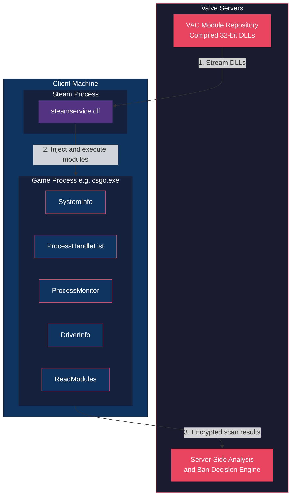
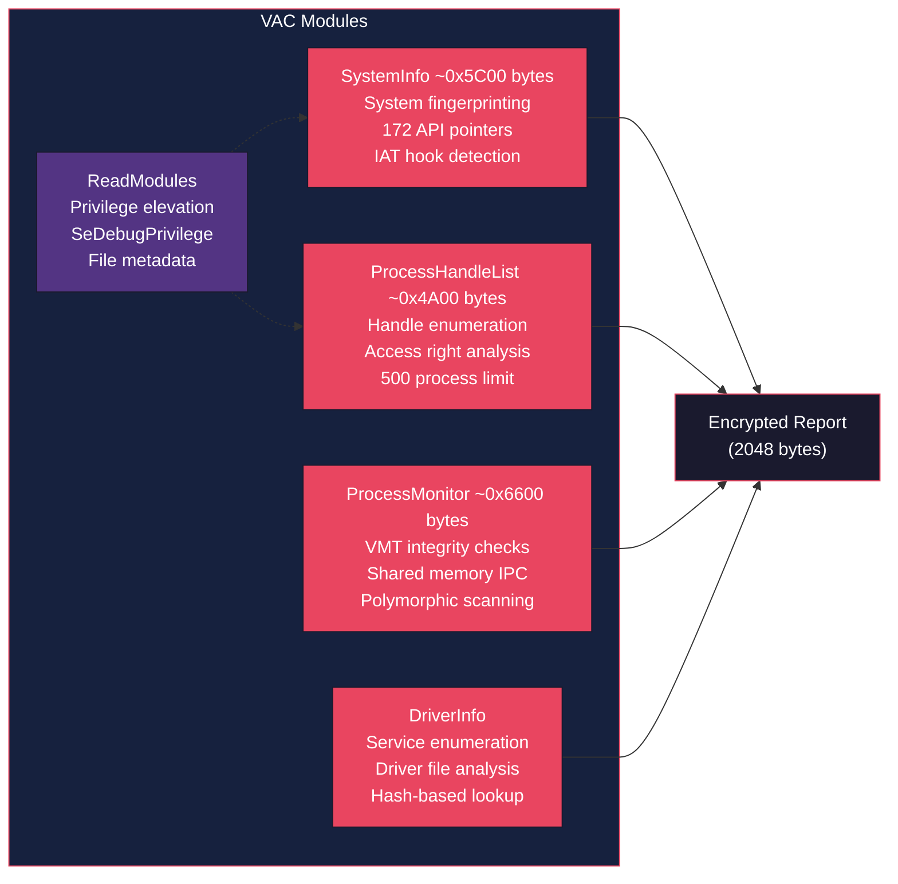
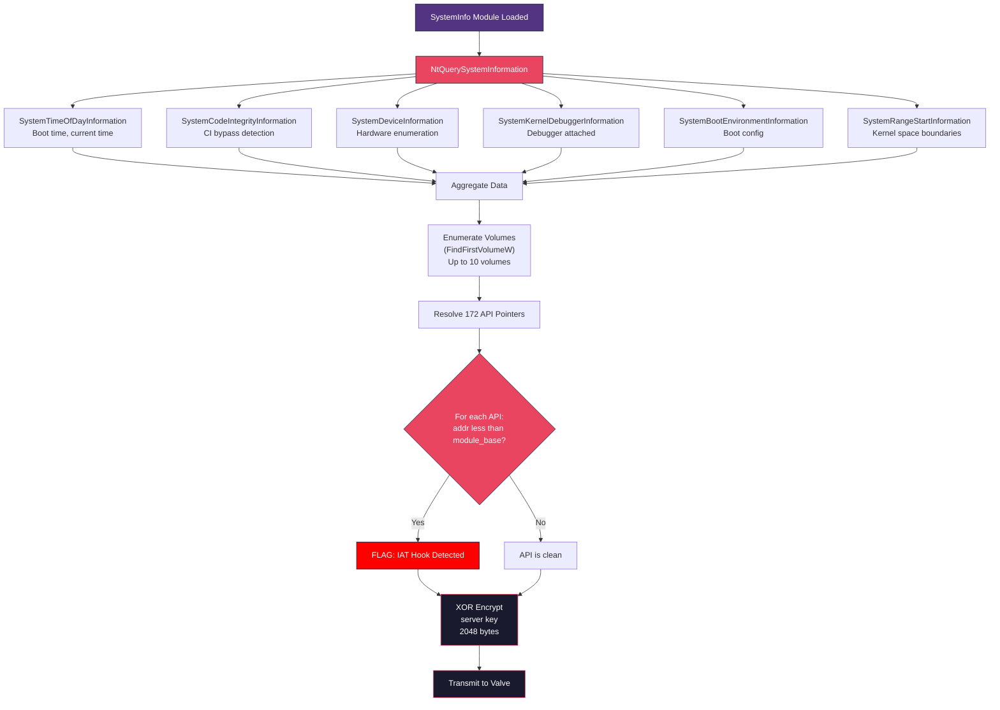
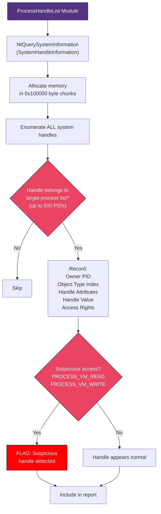
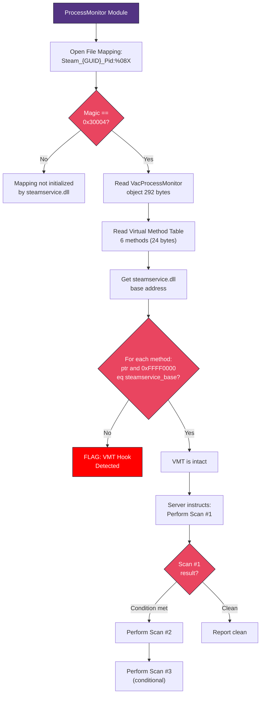
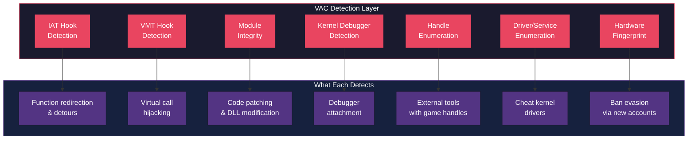
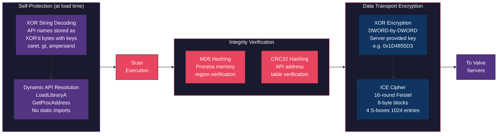
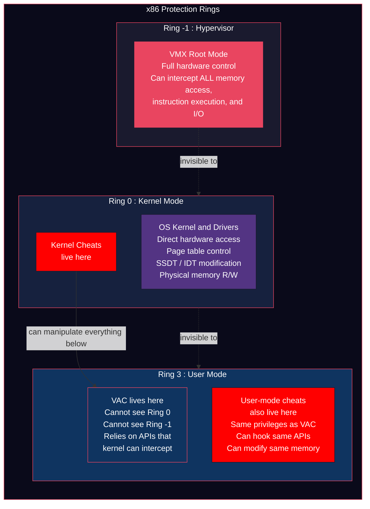
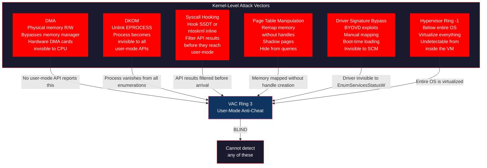

# VAC: User-Mode Anti-Cheat Analysis

Valve Anti-Cheat (VAC) as it operated in CS:GO, from [Daniel Krupinski](https://github.com/danielkrupinski/VAC)'s reverse engineering. Architecture, detection mechanisms, encryption, and limitations of user-mode anti-cheat.

> **Disclaimer:** This project is strictly educational.

---

## Table of Contents

- [How VAC Works](#how-vac-works)
- [Module Breakdown](#module-breakdown)
- [Detection Mechanisms](#detection-mechanisms)
- [Encryption and Obfuscation](#encryption-and-obfuscation)
- [Limitations of User-Mode Anti-Cheat](#limitations-of-user-mode-anti-cheat)
- [Weaknesses Against Kernel-Level Cheats](#weaknesses-against-kernel-level-cheats)
- [Credits](#credits)

---

## How VAC Works

VAC is user-mode and modular: it runs in a normal Windows process, not as a kernel driver. Flow:

1. Module delivery: 32-bit DLLs streamed from Valve's servers to the client.
2. Injection: `steamservice.dll` (in `SteamService.exe` or `Steam.exe`) loads and runs the modules in the game process.
3. Scanning: each module does one kind of scan (system info, process/handle enumeration, hook checks, drivers, etc.).
4. Reporting: results are encrypted (XOR, ICE) and sent to Valve.
5. Verdict: the client only collects and reports; the ban decision is server-side.

This server-side verdict model means VAC bans are often delayed. Valve collects data over time and issues bans in waves, making it harder for cheat developers to know exactly what triggered detection.

### Architecture Overview

---

## Module Breakdown

### Module Map

### Module 1: SystemInfo (~0x5C00 bytes)

Largest module; builds a system fingerprint. Collects: OS version, architecture, processor type; boot and current time; kernel debugger and code integrity state; up to 10 volumes (GUID hashes, serials, filesystem types); system/Windows dir paths; last 36 chars of game exe path; handles to 12–16 system DLLs; 172 Windows API function pointers (used for IAT hook detection).

Uses `NtQuerySystemInformation` with several information classes, enumerates volumes via `FindFirstVolumeW`/`FindNextVolumeW`, resolves a big API table, and checks each function address against its module base. Output: 2048 bytes, encrypted DWORD-by-DWORD with a server-provided XOR key.

### Module 2: ProcessHandleList (~0x4A00 bytes)

Detects external tools that hold handles to the game process. Calls `NtQuerySystemInformation(SystemHandleInformation)`, allocates in 0x100000-byte chunks, filters by a target list of up to 500 PIDs, and for each matching handle records owner PID, object type index, attributes, value, and access rights. Primary signal: handles with `PROCESS_VM_READ` or `PROCESS_VM_WRITE` to the game.

### Module 3: ProcessMonitor (~0x6600 bytes)

Uses a file mapping and VMT checks to validate VAC's own infra. Mapping name: `Steam_{E9FD3C51-9B58-4DA0-962C-734882B19273}_Pid:%08X`. It holds magic `0x30004` and a pointer to a `VacProcessMonitor` object (292 bytes). The module reads the object and its VMT (6 methods, 24 bytes), gets `steamservice.dll` base, and checks `(method_ptr & 0xFFFF0000) == steamservice_base` for each method; if any pointer is outside that range, the VMT is considered hooked. Scan order is server-directed; later scans depend on earlier results.

### Module 4: DriverInfo

`OpenSCManagerA` plus `EnumServicesStatusW`; for each service, name, display name, start type, path, dependencies, loader group. Volume serials and file indices for driver binaries; hash lookups against known driver signatures.

### Module 5: ReadModules

Utility: elevates to `SeDebugPrivilege` via `OpenProcessToken`/`AdjustTokenPrivileges` so VAC can read protected processes; file metadata via `GetFileInformationByHandle`.

---

## Detection Mechanisms

### Detection Overview

### Import Address Table (IAT) Hook Detection

VAC resolves and stores pointers to ~172 Windows API functions and compares each to its module's base. If the address is below base, the call has been redirected (IAT patch, detour, or trampoline).

### Virtual Method Table (VMT) Hook Detection

ProcessMonitor reads the `VacProcessMonitor` VMT from shared memory and checks that each method pointer lies inside `steamservice.dll`. Pointers outside that range indicate VMT tampering.

### Module Integrity Checks

VAC reads specific bytes from loaded modules to verify they have not been patched:
- The DOS header (first 4 bytes at the module base)
- A DWORD at offset `0x114` (PE header region)
- A DWORD at offset `0x400` (typically the `.text` section entry point)

Any modification to these bytes indicates code patching.

### Kernel Debugger Detection

Using `NtQuerySystemInformation(SystemKernelDebuggerInformation)`, VAC checks whether a kernel debugger is attached. It also queries `SystemCodeIntegrityInformation` to detect if code integrity enforcement has been tampered with.

### System Handle Enumeration

By enumerating all handles system-wide, VAC can identify processes that have opened handles to the game with suspicious access rights. A legitimate application rarely needs `PROCESS_VM_WRITE` access to a game process.

### Driver and Service Enumeration

VAC catalogs all running drivers and services, collecting their file paths, configurations, and serial numbers. This data is sent to Valve's servers where it can be matched against known cheat driver signatures.

### Hardware and Volume Fingerprinting

Volume serial numbers, GUIDs, filesystem types, and drive types are collected to build a machine fingerprint. This makes it harder to evade bans by simply creating a new Steam account, since Valve can correlate the hardware signature.

---

## Encryption and Obfuscation

### Encryption Pipeline

VAC uses multiple layers to protect its own code and communications:

| Technique | Purpose |
|-----------|---------|
| ICE cipher | 16-round Feistel for module/server traffic |
| XOR encryption | DWORD-by-DWORD scan results with server key |
| XOR string encoding | API names XOR'd with `^`/`>`/`&` to hide from static analysis |
| MD5/CRC32 | Memory and API table integrity checks |
| Dynamic API resolution | No static imports; `LoadLibraryA`/`GetProcAddress` at runtime |

---

## Limitations of User-Mode Anti-Cheat

Because VAC runs entirely in user-mode, it operates under fundamental constraints imposed by the Windows security model. These are architectural limitations, not implementation bugs.

### The Privilege Ring Problem

### 1. Equal Privilege Level

VAC runs at the same privilege level (Ring 3) as any other user-mode application, including cheats. There is no privilege asymmetry. A cheat running as a normal process has the exact same capabilities as VAC itself. It can read and write the same memory, call the same APIs, and manipulate the same data structures.

### 2. API Interception is Trivially Easy

Since VAC relies on Windows APIs (`NtQuerySystemInformation`, `OpenProcess`, `ReadProcessMemory`, etc.) for all its scanning, a cheat can hook these APIs before VAC calls them and return falsified results. VAC attempts to detect this via IAT comparison, but:
- Inline hooks (patching the first bytes of the function body) are not caught by IAT checks alone
- Hooks placed deeper in the call chain (e.g., in `ntdll.dll` syscall stubs) can be invisible to user-mode validation
- Entire DLLs can be remapped from disk to provide clean copies for VAC to read while the hooked versions remain active

### 3. VAC Can Be Unloaded or Disabled

As a user-mode DLL, VAC can be unloaded (`FreeLibrary`, module list manipulation), prevented from loading (hook `LoadLibrary` in `steamservice.dll`), suspended (suspend scan threads), or neutered (patch scan routines or return values in memory).

A kernel-mode anti-cheat cannot be unloaded this way because it runs in a protected address space.

### 4. No Visibility Into Kernel Space

VAC cannot see:
- Kernel-mode drivers loaded by cheats
- Direct kernel object manipulation (DKOM) used to hide processes
- Physical memory reads/writes performed by DMA hardware or kernel drivers
- Syscall-level hooks installed from Ring 0

It queries `NtQuerySystemInformation` for driver information, but a kernel driver can trivially hide itself from that enumeration by unlinking from the kernel's module list.

### 5. Shared Memory Can Be Manipulated

The ProcessMonitor module relies on a Windows file mapping (shared memory) to communicate with `steamservice.dll`. Any process with sufficient access can:
- Open the same file mapping by name (the naming convention is predictable)
- Modify the `VacProcessMonitor` object
- Replace the VMT pointers with addresses that still pass the base-address check (pointing to legitimate code within `steamservice.dll` that happens to do nothing harmful)

### 6. Hardware Fingerprinting is Spoofable

Volume serial numbers, GUIDs, and drive information are all retrieved through user-mode APIs. These can be intercepted and spoofed. A cheat can return fabricated hardware identifiers to defeat machine-based ban tracking.

### 7. Scan Timing is Predictable

Because VAC modules are loaded from the network and execute in a predictable pattern, a cheat can detect when a scan is occurring (by monitoring DLL loads or thread creation) and temporarily clean up before the scan runs, then resume afterward.

---

## Weaknesses Against Kernel-Level Cheats

Kernel-level cheats (Ring 0) run with higher privileges than VAC. User-mode anti-cheat cannot defend against them by design.

### Attack Surface Map

### Direct Memory Access (DMA)

A kernel driver can read and write to any physical memory address without going through the Windows memory manager. VAC has no way to detect this because:
- No user-mode API reports DMA activity
- The reads/writes bypass all access checks and logging
- Hardware-based DMA (via PCIe devices like the DMA card) does not even involve the CPU, making it completely invisible to software

### Process Hiding via DKOM

Direct Kernel Object Manipulation allows a kernel driver to unlink a process from the kernel's `EPROCESS` linked list. The process continues to run and can interact with the game, but it becomes invisible to every user-mode enumeration API (`NtQuerySystemInformation`, `CreateToolhelp32Snapshot`, Task Manager, etc.). VAC's ProcessHandleList module would never see it.

### Syscall Hooking

A kernel driver can modify the System Service Descriptor Table (SSDT) or use inline hooks on `ntoskrnl.exe` functions to intercept any syscall. When VAC calls `NtQuerySystemInformation`, the call passes through the kernel before returning results. A kernel hook can filter those results in real time, removing any evidence of the cheat from the response before it reaches user-mode.

### Page Table Manipulation

The kernel controls virtual-to-physical memory mappings via page tables. A kernel cheat can:
- Map game memory into its own address space without opening a handle (bypassing handle enumeration)
- Create shadow copies of memory pages that show clean content to VAC while the game sees modified content
- Mark its own memory pages as non-present to user-mode queries while keeping them active for execution

### Driver Signature Bypass

While Windows requires drivers to be signed, there are well-known techniques to load unsigned drivers:
- Exploiting vulnerable signed drivers (BYOVD - Bring Your Own Vulnerable Driver) to gain kernel code execution
- Manual mapping a driver into kernel memory without registering it with the service manager
- Exploiting boot-time vulnerabilities before driver signature enforcement activates

Once loaded this way, the driver is invisible to `EnumServicesStatusW` and VAC's DriverInfo module.

### Hypervisor-Level Attacks

A cheat operating at the hypervisor level (Ring -1) sits below the entire OS kernel. It can:
- Intercept and modify any memory access, instruction execution, or hardware interaction
- Present a completely virtualized view of the system to both the OS and VAC
- Remain undetectable to any software running inside the virtual machine, including kernel-mode anti-cheats

---

## Credits

Based on [Daniel Krupinski](https://github.com/danielkrupinski)'s reverse engineering; his [VAC repo](https://github.com/danielkrupinski/VAC) reconstructs the module source from compiled binaries. License: MIT.
