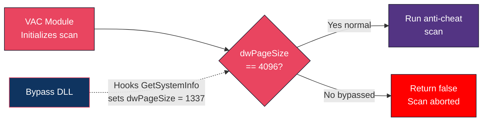
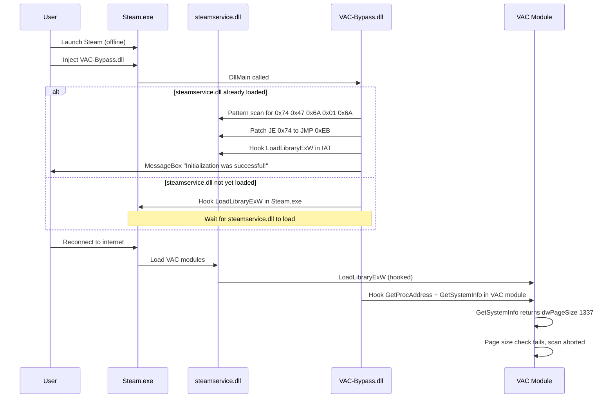
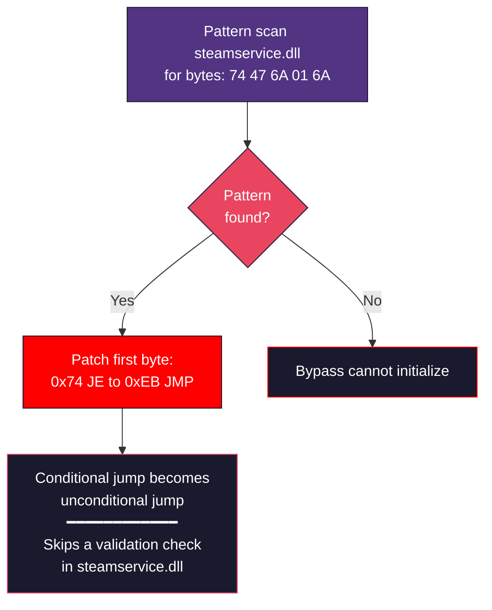
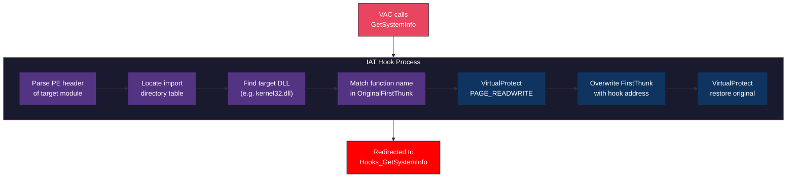
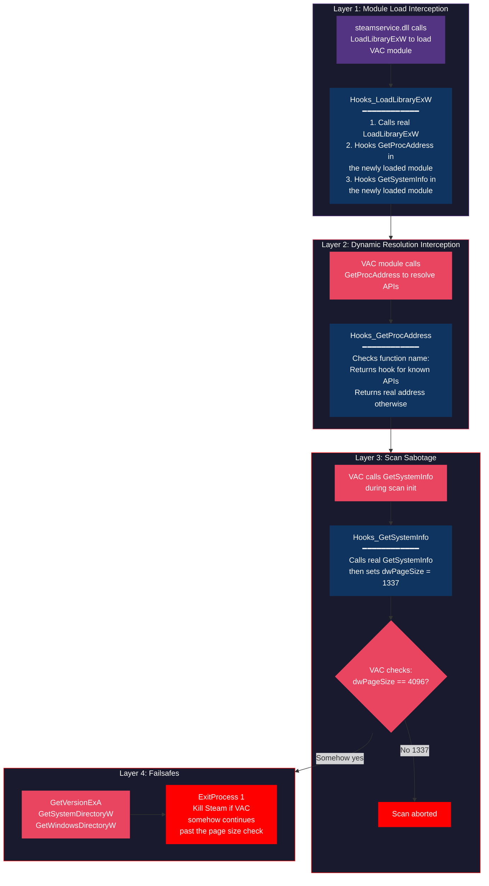
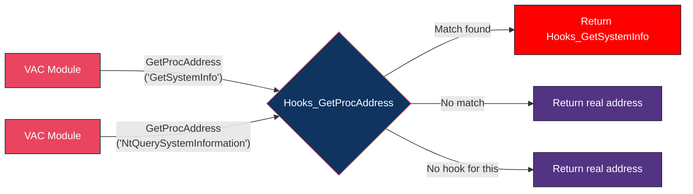

# VAC Bypass: Disabling User-Mode Anti-Cheat

How the [VAC-Bypass](https://github.com/danielkrupinski/VAC-Bypass) shuts VAC down from user-mode. Same privilege level as the protected process means the scanner can be turned off.

> **Disclaimer:** Educational only.

---

## Table of Contents

- [The Core Idea](#the-core-idea)
- [Architecture Overview](#architecture-overview)
- [The Vulnerability](#the-vulnerability)
- [Source Code Breakdown](#source-code-breakdown)
- [Hook Chain In Detail](#hook-chain-in-detail)
- [Why This Works](#why-this-works)
- [Defensive Takeaways](#defensive-takeaways)
- [Credits](#credits)

---

## The Core Idea

The whole thing comes down to one thing: VAC checks the system page size before it starts scanning. If `dwPageSize != 4096`, it returns `false` and the scan never happens. Hook `GetSystemInfo`, hand back a fake page size, and VAC shuts itself down.

~200 lines of C. That's all it takes.

### Bypass at a Glance



---

## Architecture Overview

It's a 32-bit DLL. You inject it into Steam before VAC modules load. Once it's in, it sets up a chain of IAT hooks that catch every Windows API call VAC modules make as they get loaded.

### Project Structure

```
VAC-Bypass/
├── dllmain.c     Entry point - patches steamservice.dll and installs initial hooks
├── Hooks.c       All hooked Windows API functions
├── Hooks.h       Hook function declarations
├── Utils.c       Pattern scanning and IAT hooking utilities
└── Utils.h       Utility function declarations
```

### Injection and Initialization Flow



---

## The Vulnerability

The target is a function in VAC's `Utils.c` called `Utils_getSystemInformation`. It gathers system data before a scan kicks off. Right at the top, it does a sanity check:

```
GetSystemInfo(&systemInfo);
if (systemInfo.dwPageSize != 4096)
    return false;  // Abort scan
```

On any normal Windows system, the page size is always 4096. If VAC sees anything else, it assumes the environment is broken and bails.

The bypass hooks `GetSystemInfo` to return `dwPageSize = 1337`. VAC sees the wrong page size, thinks something is off, and skips the scan entirely.

### The Patch Target

In addition to the API hooks, the bypass also patches a single byte in `steamservice.dll`:



The byte `0x74` is JE (Jump if Equal). Patching to `0xEB` (unconditional JMP) makes `steamservice.dll` skip a validation check that would otherwise catch the hook chain.

---

## Source Code Breakdown

### dllmain.c - Entry Point

The DLL entry point handles two scenarios depending on when it is injected:

If injected after `steamservice.dll` is loaded: find it with `GetModuleHandleW`, pattern-scan for `74 47 6A 01 6A`, patch JE→JMP with `VirtualProtect`, hook `LoadLibraryExW` in its IAT. If injected earlier (e.g. via a loader): hook `LoadLibraryExW` in `Steam.exe`, wait for `steamservice.dll` or `steamui.dll` to load, then do the same patch and hook setup.

### Utils.c - Pattern Scanning and IAT Hooking

Two utility functions power the bypass:

`Utils_findPattern`: scan module memory for a byte pattern (wildcard `?`), using `GetModuleInformation` for base/size; returns match pointer + optional offset. `Utils_hookImport`: parse PE import directory, find DLL and function in Original First Thunk, overwrite First Thunk with hook address under `VirtualProtect`.



### Hooks.c - The Hooked Functions

The bypass installs hooks on 7 Windows API functions. Each serves a specific purpose:

| Hook | Behavior |
|------|----------|
| `LoadLibraryExW` | Intercept DLL loads; hook each new module so every VAC module gets hooked. |
| `GetProcAddress` | Return hook addresses for known APIs; real address otherwise. Single choke point for dynamic resolution. |
| `GetSystemInfo` | Return real data then set `dwPageSize = 1337`; page size check fails, scan aborts. |
| `GetVersionExA`, `GetSystemDirectoryW`, `GetWindowsDirectoryW` | Failsafe: `ExitProcess(1)` so if the page-size trick fails, Steam exits before a report is sent. |
| `GetCurrentProcessId`, `GetCurrentThreadId` | Return 0 to obscure process/thread identity. |

---

## Hook Chain In Detail

The hooks work in layers. Since VAC modules resolve all their APIs at runtime through `GetProcAddress` (instead of static imports), the bypass hooks `GetProcAddress` itself to control what pointers VAC gets.



### The GetProcAddress Hook

VAC modules don't statically import their APIs. They call `GetProcAddress` at runtime to resolve function pointers, which is meant to stop people from seeing what APIs the module uses just by looking at the import table.

Problem is, that also means every single API lookup funnels through one function. Hook that, and you control what VAC gets back for anything it asks for:



The irony: VAC's own anti-RE technique (dynamic resolution) made it easier to beat, because everything goes through one hookable function.

### The Failsafe Hooks

Three hooks (`GetVersionExA`, `GetSystemDirectoryW`, `GetWindowsDirectoryW`) don't bother returning fake data. They just call `ExitProcess(1)` and kill Steam.

If VAC somehow gets past the `GetSystemInfo` hook and keeps scanning, it'll eventually call one of these to gather system info. At that point, faking the data isn't safe, so the bypass just nukes Steam before VAC can finish its scan and phone home.

If the bypass fails quietly, a report can go to Valve. If it fails by killing Steam, nothing is sent.

---

## Why This Works

This bypass works because of a few things that are just baked into how user-mode anti-cheat works:

### 1. Same Privilege Level

The bypass DLL runs at Ring 3, same as Steam and VAC. There's nothing stopping it from reading, writing, or hooking any code in the process.

### 2. IAT Hooks Are Trivial From Within

The IAT is just a writable data structure in every loaded module. `VirtualProtect` + a pointer write and you're done. VAC does check for IAT hooks (comparing function addresses to module bases), but that check runs *after* `GetSystemInfo` gets called. By then, the hook already returned fake data and the scan already bailed.

### 3. Dynamic API Resolution Backfires

VAC uses `GetProcAddress` at runtime to avoid static imports. That puts every API resolution through one function; hook it and you control what VAC gets for any API it resolves.

### 4. Single Point of Failure

The whole scan lives or dies on one page size check. Fake one value and the entire anti-cheat stops running. No backup check, no secondary validation, no server-side cross-reference.

### 5. No Self-Integrity Verification

VAC modules never check their own import tables before using them. If they did, they'd notice that `GetProcAddress` or `GetSystemInfo` is pointing somewhere unexpected. ProcessMonitor validates the VMT for `steamservice.dll`, but the scan modules themselves never look at their own IATs.

### 6. Predictable Code Patterns

The `steamservice.dll` patch relies on a 5-byte pattern (`74 47 6A 01 6A`) that has been stable across versions.

---

## Defensive Takeaways

Why the industry moved to kernel-level anti-cheat (EAC, BattlEye, Vanguard):

| Weakness | Lesson |
|----------|--------|
| Single validation check | Critical security decisions should have redundant, independent checks |
| No IAT self-verification | Security software should verify its own integrity before trusting API results |
| Hookable API resolution | Sensitive operations should use direct syscalls, not `GetProcAddress` |
| Writable import tables | Consider using direct syscall stubs or encrypted function pointers |
| User-mode execution | Security-critical code needs higher privilege levels to resist tampering |
| Predictable patterns | Code should be polymorphic or obfuscated to resist pattern scanning |

### What Kernel-Mode Anti-Cheat Solves

```mermaid
flowchart LR
    subgraph USERMODE["User-Mode (VAC)"]
        direction TB
        U1["Hookable APIs"]
        U2["Writable IAT"]
        U3["Same privilege as cheats"]
        U4["Can be unloaded"]
        U5["Predictable patterns"]
    end

    subgraph KERNELMODE["Kernel-Mode (EAC, BattlEye, Vanguard)"]
        direction TB
        K1["Direct hardware access"]
        K2["Protected memory space"]
        K3["Higher privilege than cheats"]
        K4["Cannot be unloaded by user-mode"]
        K5["Can detect user-mode hooks"]
    end

    USERMODE -->|"Industry learned<br/>from these weaknesses"| KERNELMODE

    style USERMODE fill:#ff0000,stroke:#1a1a2e,color:#fff
    style KERNELMODE fill:#533483,stroke:#1a1a2e,color:#fff
    style U1 fill:#1a1a2e,stroke:#ff0000,color:#fff
    style U2 fill:#1a1a2e,stroke:#ff0000,color:#fff
    style U3 fill:#1a1a2e,stroke:#ff0000,color:#fff
    style U4 fill:#1a1a2e,stroke:#ff0000,color:#fff
    style U5 fill:#1a1a2e,stroke:#ff0000,color:#fff
    style K1 fill:#1a1a2e,stroke:#533483,color:#fff
    style K2 fill:#1a1a2e,stroke:#533483,color:#fff
    style K3 fill:#1a1a2e,stroke:#533483,color:#fff
    style K4 fill:#1a1a2e,stroke:#533483,color:#fff
    style K5 fill:#1a1a2e,stroke:#533483,color:#fff
```



---

## Credits

[Daniel Krupinski](https://github.com/danielkrupinski): [VAC-Bypass](https://github.com/danielkrupinski/VAC-Bypass), [VAC](https://github.com/danielkrupinski/VAC). License: MIT.
